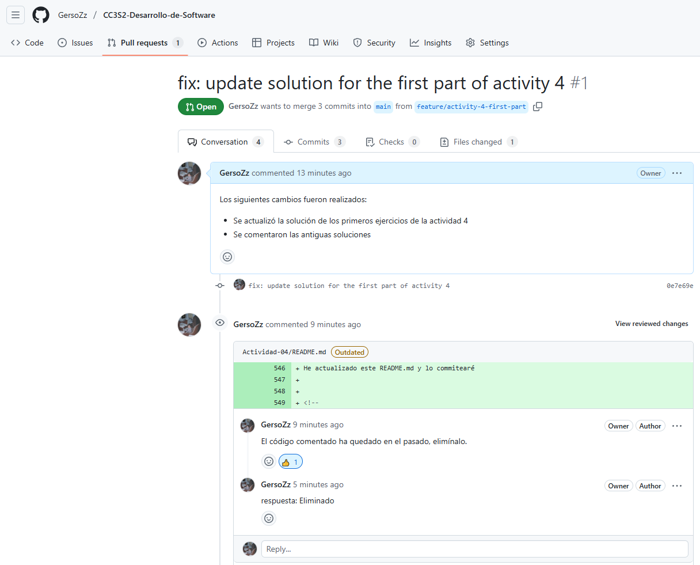
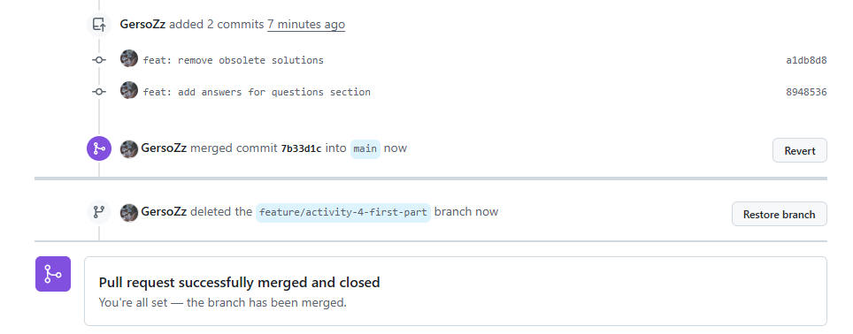

## Actividad 4

Establezco la información de usuario que será registrada en los commits
```bash
git config --global user.name "GersoZz"
git config --global user.email "gersonzuniga@uni.pe"
```

Verifico la información

```bash
$ git config --global -l
user.name=GersoZz
user.email=gersonzuniga@uni.pe
```

Creamos un directorio y nos posicionamos en él
```bash
mkdir Actividad-04
cd Actividad-04
```

Inicializamos un repositorio local de git

```bash
$ git init
Initialized empty Git repository in F:/UNI/25-1/CC3S2A - Desarrollo de Software/Actividad-04/.git/
```


Creamos el archivo README.md
```bash
echo "README" > README.md
```

Revisamos los cambios detectados por git 
```bash
$ git status
On branch main

No commits yet

Untracked files:
  (use "git add <file>..." to include in what will be committed)
        README.md

nothing added to commit but untracked files present (use "git add" to track)
```

Agregamos el archivo al área de preparación
```bash
git add README.md
git status
```

Revisamos nuevamente los cambios

```bash
$ git status
On branch main

No commits yet

Changes to be committed:
  (use "git rm --cached <file>..." to unstage)
        new file:   README.md
```

Visualizamos que el archivo ha sido agregado al área de preparación y está listo para ser commiteado

Procedemos a hacer un commit 

```bash
$ git commit -m "Initial commit with README.md"
[main (root-commit) f65d30a] Initial commit with README.md
 1 file changed, 1 insertion(+)
 create mode 100644 README.md
```

revisamos nuevamente con git status

```bash
$ git status
On branch main
nothing to commit, working tree clean
```

Vemos que ya no tenemos cambios en el area de preparación, el único cambio que había fue comiteado

Revisamos el historial de commits
```bash
$ git log
commit f65d30a54919a5b7baf242906c109d19c7b80b07 (HEAD -> main)
Author: GersoZz <gersonzuniga@uni.pe>
Date:   Mon Apr 14 09:48:38 2025 -0500

    Initial commit with README.md
```

Probamos otra forma de revisar el historial de commits

```bash
$ git log --graph --pretty=format:'%x09 %h %ar ("%an") %s'
*        f65d30a 6 minutes ago ("GersoZz") Initial commit with README.md
```

Visualizamos que este comando muestra el hash del commit, hace cuanto fue comiteado, el usuario que lo hizo y el mensaje del commit

### Agregamos el archivo CONTRIBUTING y actualizamos el README

```bash
$ echo "CONTRIBUTING" > CONTRIBUTING.md
$ echo "README\n\nWelcome to the project" > README.md
$ git add .

W10@W10PC MINGW64 /f/UNI/25-1/CC3S2A - Desarrollo de Software/Actividad-04 (main)
$ git commit -m "Set up the repository base documentation"
[main 95cc685] Set up the repository base documentation
 2 files changed, 2 insertions(+), 1 deletion(-)
 create mode 100644 CONTRIBUTING.md
```

### Agregamos un archivo Python

```bash
$ echo "print('Hello World')" > main.py
$ git add .

W10@W10PC MINGW64 /f/UNI/25-1/CC3S2A - Desarrollo de Software/Actividad-04 (main)
$ git commit -m "Add main.py"
[main f45c517] Add main.py
 1 file changed, 1 insertion(+)
 create mode 100644 main.py
```

### Revisamos el historial de commits

```bash
$ git log --oneline
f45c517 (HEAD -> main) Add main.py
95cc685 Set up the repository base documentation
f65d30a Initial commit with README.md
```
Visualizamos el commit donde agregamos al archivo main.py

## Ramas

Creamos una rama y nos pasamos a ellla

```bash
W10@W10PC MINGW64 /f/UNI/25-1/CC3S2A - Desarrollo de Software/Actividad-04 (main)
$ git branch feature/new-feature

W10@W10PC MINGW64 /f/UNI/25-1/CC3S2A - Desarrollo de Software/Actividad-04 (main)
$ git checkout feature/new-feature
Switched to branch 'feature/new-feature'
```

## Preguntas


### ¿Cómo te ha ayudado Git a mantener un historial claro y organizado de tus cambios?

Cada progreso que hago en mi código lo registro mediante un commit. Si más adelante me doy cuenta que cierta feature está fallando, puedo revisar exactamente el commit donde hice ese cambio y corregirlo facilmente.

### ¿Qué beneficios ves en el uso de ramas para desarrollar nuevas características o corregir errores?

Es útil para separar el código que se va a usar en los dintintos ambientes: Producción, Pruebas, Desarrollo. De esta forma nos aseguramos que el código que se usa en producción sea lo mejor posible.

## Ejercicio 1 Manejo avanzado de ramas y resolución de conflictos

```bash
W10@W10PC MINGW64 /f/UNI/25-1/CC3S2A - Desarrollo de Software/Actividad-04 (main)
$ git branch feature/advanced-feature

W10@W10PC MINGW64 /f/UNI/25-1/CC3S2A - Desarrollo de Software/Actividad-04 (main)
$ git checkout feature/advanced-feature
Switched to branch 'feature/advanced-feature'
```

Hacemos una edicion en main.py y commiteamos el cambio

```bash
W10@W10PC MINGW64 /f/UNI/25-1/CC3S2A - Desarrollo de Software/Actividad-04 (feature/advanced-feature)
$ git add main.py

W10@W10PC MINGW64 /f/UNI/25-1/CC3S2A - Desarrollo de Software/Actividad-04 (feature/advanced-feature)
$ git commit -m "Add greet function in advanced feature"
[feature/advanced-feature c613936] Add greet function in advanced feature
 1 file changed, 4 insertions(+), 1 deletion(-)
```

Nos movemos a la rama main y editamos main.py

```bash
W10@W10PC MINGW64 /f/UNI/25-1/CC3S2A - Desarrollo de Software/Actividad-04 (main)
$ git add main.py

W10@W10PC MINGW64 /f/UNI/25-1/CC3S2A - Desarrollo de Software/Actividad-04 (main)
$ git commit -m "Update main.py message in main branch"
[main aedc143] Update main.py message in main branch
 1 file changed, 1 insertion(+), 1 deletion(-)
```

Intentamos hacer merge de la rama feature/advanced-feature en la rama main

```bash
W10@W10PC MINGW64 /f/UNI/25-1/CC3S2A - Desarrollo de Software/Actividad-04 (main)
$ git merge feature/advanced-feature
Auto-merging main.py
CONFLICT (content): Merge conflict in main.py
Automatic merge failed; fix conflicts and then commit the result.
```

Nos sale que hay un conflicto, lo resolvemos


Abrimos el archivo main.py
```bash
W10@W10PC MINGW64 /f/UNI/25-1/CC3S2A - Desarrollo de Software/Actividad-04 (main|MERGING)
$ vi main.py
```

Visualizamos el conflicto
```bash
<<<<<<< HEAD
print('Hello World - updated in main')
=======
def greet():
    print('Hello from advanced feature')
greet()
>>>>>>> feature/advanced-feature
~
```

Resolvemos el conflicto
```bash
def greet():
    print('Hello from advanced feature')
    print('Hello World - updated in main')
greet()
~
```

Registramos el cambio en un commit
```bash
W10@W10PC MINGW64 /f/UNI/25-1/CC3S2A - Desarrollo de Software/Actividad-04 (main|MERGING)
$ git add main.py

W10@W10PC MINGW64 /f/UNI/25-1/CC3S2A - Desarrollo de Software/Actividad-04 (main|MERGING)
$ git status
On branch main
All conflicts fixed but you are still merging.
  (use "git commit" to conclude merge)

Changes to be committed:
        modified:   main.py


W10@W10PC MINGW64 /f/UNI/25-1/CC3S2A - Desarrollo de Software/Actividad-04 (main|MERGING)
$ git commit -m "Resolve merge conflict between main and feature/advanced-feature"
[main d172c03] Resolve merge conflict between main and feature/advanced-feature
```

Finalmente borramos la rama que fusionamos
```bash
W10@W10PC MINGW64 /f/UNI/25-1/CC3S2A - Desarrollo de Software/Actividad-04 (main)
$ git branch -d feature/advanced-feature
Deleted branch feature/advanced-feature (was c613936).
```
…

##  Ejercicio 2: Exploración y manipulación del historial de commits

### 1. Ver el historial detallado de commits:

```bash
git log -p
```

Se visualiza todos los commits con los cambios especificos que se realizaron


### 2. Filtrar commits por autor

```bash
git log --author="GersoZz"
```
Aparece todos los commits que hizo el usuario "GersoZz"

### 3. Revertir un commit

Dado que el último commit fue de un merge que resolvía un conflicto entre la rama `feature/advanced-feature` y la rama `main`, usaremos el flag `-m 1` para decirle al comando revert que mantenga los cambios de la rama main y no los de la rama `feature/advanced-feature` 

```bash
git revert -m 1 HEAD
```

En efecto verificamos que el nuevo commit de revert se ha registrado

```bash
$ git log --oneline
2c7deae (HEAD -> main) Revert "Resolve merge conflict between main and feature/advanced-feature"
d172c03 Resolve merge conflict between main and feature/advanced-feature
aedc143 Update main.py message in main branch
c613936 Add greet function in advanced feature
f45c517 (feature/new-feature) Add main.py
95cc685 Set up the repository base documentation
f65d30a Initial commit with README.md
```

### 4. Rebase interactivo

Para una ejecución más limpia de este comando realizamos 4 commits sencillos y luego fusionaremos los 3 últimos usando squash

```bash
$ git log --oneline
f9023ab (HEAD -> main) add file_D
3633723 add file_C
d12194a add file_B
e76cc73 add file_A
2c7deae Revert "Resolve merge conflict between main and feature/advanced-feature"
d172c03 Resolve merge conflict between main and feature/advanced-feature
aedc143 Update main.py message in main branch
c613936 Add greet function in advanced feature
f45c517 (feature/new-feature) Add main.py
95cc685 Set up the repository base documentation
f65d30a Initial commit with README.md
```

Ejecutamos el rebase interactivo
```bash
$ git rebase -i HEAD~3
```

Establecemos la nueva configuracion

```bash
pick d12194a add file_B
squash 3633723 add file_C
squash f9023ab add file_D
# Rebase e76cc73..f9023ab onto e76cc73 (3 commands)
#
# Commands:
```

Como resultado, hemos fusionado los 3 ultimos commits

```bash
W10@W10PC MINGW64 /f/UNI/25-1/CC3S2A - Desarrollo de Software/Actividad-04 (main)
$ git rebase -i HEAD~3
[detached HEAD 4bcb63d] add files B, C, and D
 Date: Mon Apr 14 10:48:50 2025 -0500
 3 files changed, 3 insertions(+)
 create mode 100644 file_B.txt
 create mode 100644 file_C.txt
 create mode 100644 file_D.txt
Successfully rebased and updated refs/heads/main.
```

El historial de commits ha quedado asi,

```bash
W10@W10PC MINGW64 /f/UNI/25-1/CC3S2A - Desarrollo de Software/Actividad-04 (main)
$ git log --oneline
4bcb63d (HEAD -> main) add files B, C, and D
e76cc73 add file_A
2c7deae Revert "Resolve merge conflict between main and feature/advanced-feature"
d172c03 Resolve merge conflict between main and feature/advanced-feature
aedc143 Update main.py message in main branch
c613936 Add greet function in advanced feature
f45c517 (feature/new-feature) Add main.py
95cc685 Set up the repository base documentation
f65d30a Initial commit with README.md
```

### 5. Visualización gráfica del historial:
Con este comando es fácil ver como las ramas se han fusionado

```bash
git log --graph --oneline --all
```

```bash
$ git log --graph --oneline --all
* 4bcb63d (HEAD -> main) add files B, C, and D
* e76cc73 add file_A
* 2c7deae Revert "Resolve merge conflict between main and feature/advanced-feature"
*   d172c03 Resolve merge conflict between main and feature/advanced-feature
|\
| * c613936 Add greet function in advanced feature
* | aedc143 Update main.py message in main branch
|/
* f45c517 (feature/new-feature) Add main.py
* 95cc685 Set up the repository base documentation
* f65d30a Initial commit with README.md
```
## Ejercicio 3: Creación y gestión de ramas desde commits específicos

Creamos una nueva rama desde el commit `2c7deae`

```bash
W10@W10PC MINGW64 /f/UNI/25-1/CC3S2A - Desarrollo de Software/Actividad-04 (main)
$ git branch bugfix/rollback-feature 2c7deae

W10@W10PC MINGW64 /f/UNI/25-1/CC3S2A - Desarrollo de Software/Actividad-04 (main)
$ git checkout bugfix/rollback-feature
Switched to branch 'bugfix/rollback-feature'
```

Realizamos un cambio en main.py y lo commiteamos

```bash
W10@W10PC MINGW64 /f/UNI/25-1/CC3S2A - Desarrollo de Software/Actividad-04 (bugfix/rollback-feature)
$ vi main.py

W10@W10PC MINGW64 /f/UNI/25-1/CC3S2A - Desarrollo de Software/Actividad-04 (bugfix/rollback-feature)
$ git add main.py

W10@W10PC MINGW64 /f/UNI/25-1/CC3S2A - Desarrollo de Software/Actividad-04 (bugfix/rollback-feature)
$ git commit -m "Fix bug in rollback feature"
[bugfix/rollback-feature 76d27c5] Fix bug in rollback feature
 1 file changed, 2 insertions(+), 1 deletion(-)
```

Fusionaremos el cambio realizado, en la rama `bugfix/rollback-feature`, en la rama `main`

```bash
W10@W10PC MINGW64 /f/UNI/25-1/CC3S2A - Desarrollo de Software/Actividad-04 (bugfix/rollback-feature)
$ git checkout main
Switched to branch 'main'

W10@W10PC MINGW64 /f/UNI/25-1/CC3S2A - Desarrollo de Software/Actividad-04 (main)
$ git merge bugfix/rollback-feature
Merge made by the 'ort' strategy.
 main.py | 3 ++-
 1 file changed, 2 insertions(+), 1 deletion(-)
```
La fusion se hizo sin conflictos, revisamos el historial de commits

```bash
W10@W10PC MINGW64 /f/UNI/25-1/CC3S2A - Desarrollo de Software/Actividad-04 (main)
$ git log --graph --oneline
*   7f8b57c (HEAD -> main) Merge branch 'bugfix/rollback-feature'
|\
| * 76d27c5 (bugfix/rollback-feature) Fix bug in rollback feature
* | 4bcb63d add files B, C, and D
* | e76cc73 add file_A
|/
* 2c7deae Revert "Resolve merge conflict between main and feature/advanced-feature"
*   d172c03 Resolve merge conflict between main and feature/advanced-feature
|\
| * c613936 Add greet function in advanced feature
* | aedc143 Update main.py message in main branch
|/
* f45c517 (feature/new-feature) Add main.py
* 95cc685 Set up the repository base documentation
* f65d30a Initial commit with README.md
```

Finalmente borramos la rama donde se hizo la actualizacion
```bash
W10@W10PC MINGW64 /f/UNI/25-1/CC3S2A - Desarrollo de Software/Actividad-04 (main)
$ git branch -d bugfix/rollback-feature
Deleted branch bugfix/rollback-feature (was 76d27c5).
```
### Ejercicio 4: Manipulación y restauración de commits con git reset y git restore
#### git reset

Editamos main.py y commiteamos
```bash
W10@W10PC MINGW64 /f/UNI/25-1/CC3S2A - Desarrollo de Software/Actividad-04 (main)
$ vi main.py

W10@W10PC MINGW64 /f/UNI/25-1/CC3S2A - Desarrollo de Software/Actividad-04 (main)
$ git add main.py

W10@W10PC MINGW64 /f/UNI/25-1/CC3S2A - Desarrollo de Software/Actividad-04 (main)
$ git commit -m "Introduce a change to be reset"
[main 576dd66] Introduce a change to be reset
 1 file changed, 1 insertion(+), 2 deletions(-)
```

Ejecutamos el git reset hard
```bash
W10@W10PC MINGW64 /f/UNI/25-1/CC3S2A - Desarrollo de Software/Actividad-04 (main)
$ git reset --hard HEAD~1
HEAD is now at 7f8b57c Merge branch 'bugfix/rollback-feature'
```

Visualizamos que con git reset no queda rastro de que alguna vez se realizo el commit

```bash
W10@W10PC MINGW64 /f/UNI/25-1/CC3S2A - Desarrollo de Software/Actividad-04 (main)
$ git log --oneline
7f8b57c (HEAD -> main) Merge branch 'bugfix/rollback-feature'
76d27c5 Fix bug in rollback feature
4bcb63d add files B, C, and D
e76cc73 add file_A
2c7deae Revert "Resolve merge conflict between main and feature/advanced-feature"
d172c03 Resolve merge conflict between main and feature/advanced-feature
aedc143 Update main.py message in main branch
c613936 Add greet function in advanced feature
f45c517 (feature/new-feature) Add main.py
95cc685 Set up the repository base documentation
f65d30a Initial commit with README.md
```

#### git restore


Realizamos un cambio en el README.md

```bash
W10@W10PC MINGW64 /f/UNI/25-1/CC3S2A - Desarrollo de Software/Actividad-04 (main)
$ echo "Another line in README" >> README.md
```

Visualizamos que existe una modificacion

```bash
W10@W10PC MINGW64 /f/UNI/25-1/CC3S2A - Desarrollo de Software/Actividad-04 (main)
$ git status
On branch main
Changes not staged for commit:
  (use "git add <file>..." to update what will be committed)
  (use "git restore <file>..." to discard changes in working directory)
        modified:   README.md

no changes added to commit (use "git add" and/or "git commit -a")
```

Deshacemos los cambios realizados con `git restore` y verificamos los cambios
```bash
W10@W10PC MINGW64 /f/UNI/25-1/CC3S2A - Desarrollo de Software/Actividad-04 (main)
$ git restore README.md

W10@W10PC MINGW64 /f/UNI/25-1/CC3S2A - Desarrollo de Software/Actividad-04 (main)
$ git status
On branch main
nothing to commit, working tree clean
```

Visualizamos que `git restore` deshace los cambios que se quedaron en el workspace

### Ejercicio 5: Trabajo colaborativo y manejo de Pull Requests
En este ejercicio usaré este repositorio

```bash
W10@W10PC MINGW64 /f/UNI/25-1/CC3S2A - Desarrollo de Software/repositorio (main)
$ git checkout -b feature/activity-4-first-part
Switched to a new branch 'feature/activity-4-first-part'
```
He actualizado este README.md y lo commitearé

```bash
W10@W10PC MINGW64 /f/UNI/25-1/CC3S2A - Desarrollo de Software/repositorio (feature/activity-4-first-part)
$ git add Actividad-04/README.md

W10@W10PC MINGW64 /f/UNI/25-1/CC3S2A - Desarrollo de Software/repositorio (feature/activity-4-first-part)
$ git commit -m "fix: update solution for the first part of activity 4"
[feature/activity-4-first-part 0e7e69e] fix: update solution for the first part of activity 4
 1 file changed, 550 insertions(+)

W10@W10PC MINGW64 /f/UNI/25-1/CC3S2A - Desarrollo de Software/repositorio (feature/activity-4-first-part)
$ git push origin feature/activity-4-first-part
Enumerating objects: 7, done.
Counting objects: 100% (7/7), done.
Delta compression using up to 16 threads
Compressing objects: 100% (4/4), done.
Writing objects: 100% (4/4), 4.55 KiB | 4.55 MiB/s, done.
Total 4 (delta 2), reused 0 (delta 0), pack-reused 0 (from 0)
remote: Resolving deltas: 100% (2/2), completed with 2 local objects.
remote:
remote: Create a pull request for 'feature/activity-4-first-part' on GitHub by visiting:
remote:      https://github.com/GersoZz/CC3S2-Desarrollo-de-Software/pull/new/feature/activity-4-first-part
remote:
To https://github.com/GersoZz/CC3S2-Desarrollo-de-Software.git
 * [new branch]      feature/activity-4-first-part -> feature/activity-4-first-part
```

Realizamos el PR y resolvimos las observaciones dejadas en forma de comentarios



La rama fue fusionada y luego eliminada



Ahora borraremos la rama de nuestro repositorio local. Para esto nos moveremos a la rama `main` y luego ejecutaremos el comando `git branch -d feature/activity-4-first-part`. Pues no podemos borrar la rama donde nos encontramos.

```bash
W10@W10PC MINGW64 /f/UNI/25-1/CC3S2A - Desarrollo de Software/repositorio (feature/activity-4-first-part)
$ git checkout main
Switched to branch 'main'
Your branch is up to date with 'origin/main'.

W10@W10PC MINGW64 /f/UNI/25-1/CC3S2A - Desarrollo de Software/repositorio (main)
$ git branch -d feature/activity-4-first-part
warning: deleting branch 'feature/activity-4-first-part' that has been merged to
         'refs/remotes/origin/feature/activity-4-first-part', but not yet merged to HEAD
Deleted branch feature/activity-4-first-part (was 8948536).
```
Visualizamos que la rama fue eliminada. Y también recibimos advertencia de que los cambios realizados todavía no están en la rama `main` de nuestro repositorio local. 

Ejecutamos `git pull origin main` para traer desde el repositorio remoto los cambios que ya fueron fusionados ahí.

```bash
W10@W10PC MINGW64 /f/UNI/25-1/CC3S2A - Desarrollo de Software/repositorio (main)
$ git pull origin main
remote: Enumerating objects: 1, done.
remote: Counting objects: 100% (1/1), done.
remote: Total 1 (delta 0), reused 0 (delta 0), pack-reused 0 (from 0)
Unpacking objects: 100% (1/1), 943 bytes | 314.00 KiB/s, done.
From https://github.com/GersoZz/CC3S2-Desarrollo-de-Software
 * branch            main       -> FETCH_HEAD
   abcd30d..7b33d1c  main       -> origin/main
Updating abcd30d..7b33d1c
Fast-forward
 Actividad-04/README.md | 535 ++++++++++++++++++++++++++++++++++++++++++++++---
 1 file changed, 504 insertions(+), 31 deletions(-)
```
Visualizamos que ya contamos con los cambios de la rama `feature/activity-4-first-part` en la rama `main` de nuestro repositorio local.

Finalmente listamos nuestras ramas.
```bash
W10@W10PC MINGW64 /f/UNI/25-1/CC3S2A - Desarrollo de Software/repositorio (main)
$ git branch
  develop
  feature/login
  feature/new-feature
  feature/questions-first-part
* main
```

### Ejercicio 6: Cherry-Picking y Git Stash

### cherry pick
Editamos main .py y commiteamos

```bash
$ echo -e "\nprint('Cherry pick this')" >> main.py

W10@W10PC MINGW64 /f/UNI/25-1/CC3S2A - Desarrollo de Software/Actividad-04 (main)
$ git add main.py

W10@W10PC MINGW64 /f/UNI/25-1/CC3S2A - Desarrollo de Software/Actividad-04 (main)
$ git commit -m "Add cherry-pick example"
[main 16dadd8] Add cherry-pick example
 1 file changed, 2 insertions(+), 1 deletion(-)

W10@W10PC MINGW64 /f/UNI/25-1/CC3S2A - Desarrollo de Software/Actividad-04 (feature/cherry-pick)
$ git log --oneline
16dadd8 (HEAD -> main) Add cherry-pick example
7f8b57c Merge branch 'bugfix/rollback-feature'
76d27c5 Fix bug in rollback feature
4bcb63d add files B, C, and D
e76cc73 add file_A
2c7deae Revert "Resolve merge conflict between main and feature/advanced-feature"
d172c03 Resolve merge conflict between main and feature/advanced-feature
aedc143 Update main.py message in main branch
c613936 Add greet function in advanced feature
f45c517 (feature/new-feature) Add main.py
95cc685 Set up the repository base documentation
f65d30a Initial commit with README.md
```

Creamos la rama feature/cherry-pick a partir del commit anterior `7f8b57c`

```bash
W10@W10PC MINGW64 /f/UNI/25-1/CC3S2A - Desarrollo de Software/Actividad-04 (main)
$ git branch feature/cherry-pick 7f8b57c

W10@W10PC MINGW64 /f/UNI/25-1/CC3S2A - Desarrollo de Software/Actividad-04 (main)
$ git checkout feature/cherry-pick
Switched to branch 'feature/cherry-pick'
```

Aplicamos el cherry pick

```bash
W10@W10PC MINGW64 /f/UNI/25-1/CC3S2A - Desarrollo de Software/Actividad-04 (feature/cherry-pick)
$ git cherry-pick 16dadd8
[feature/cherry-pick a90773e] Add cherry-pick example
 Date: Mon Apr 14 14:47:50 2025 -0500
 1 file changed, 2 insertions(+), 1 deletion(-)

W10@W10PC MINGW64 /f/UNI/25-1/CC3S2A - Desarrollo de Software/Actividad-04 (feature/cherry-pick)
$ git log --oneline -n 4
a90773e (HEAD -> feature/cherry-pick) Add cherry-pick example
7f8b57c Merge branch 'bugfix/rollback-feature'
76d27c5 Fix bug in rollback feature
4bcb63d add files B, C, and D
```

Visualizamos que el commit fue agregado en la rama `feature/cherry-pick`

### stash

Actualizamos el archivo main.py

```bash
W10@W10PC MINGW64 /f/UNI/25-1/CC3S2A - Desarrollo de Software/Actividad-04 (main)
$ echo -e "\nThis change is stashed" >> main.py

W10@W10PC MINGW64 /f/UNI/25-1/CC3S2A - Desarrollo de Software/Actividad-04 (main)
$ git status
On branch main
Changes not staged for commit:
  (use "git add <file>..." to update what will be committed)
  (use "git restore <file>..." to discard changes in working directory)
        modified:   main.py

no changes added to commit (use "git add" and/or "git commit -a")
```

Guardamos el cambio en un stash
```bash
W10@W10PC MINGW64 /f/UNI/25-1/CC3S2A - Desarrollo de Software/Actividad-04 (main)
$ git stash
Saved working directory and index state WIP on main: 16dadd8 Add cherry-pick example

W10@W10PC MINGW64 /f/UNI/25-1/CC3S2A - Desarrollo de Software/Actividad-04 (main)
$ git stash list
stash@{0}: WIP on main: 16dadd8 Add cherry-pick example

W10@W10PC MINGW64 /f/UNI/25-1/CC3S2A - Desarrollo de Software/Actividad-04 (main)
$ git status
On branch main
nothing to commit, working tree clean
```

Recuperamos el cambio

```bash
W10@W10PC MINGW64 /f/UNI/25-1/CC3S2A - Desarrollo de Software/Actividad-04 (main)
$ git stash pop
On branch main
Changes not staged for commit:
  (use "git add <file>..." to update what will be committed)
  (use "git restore <file>..." to discard changes in working directory)
        modified:   main.py

no changes added to commit (use "git add" and/or "git commit -a")
Dropped refs/stash@{0} (b74bf96738345d62220ad8e18b7328d821aa7052)

W10@W10PC MINGW64 /f/UNI/25-1/CC3S2A - Desarrollo de Software/Actividad-04 (main)
$ git stash list

W10@W10PC MINGW64 /f/UNI/25-1/CC3S2A - Desarrollo de Software/Actividad-04 (main)
$ git status
On branch main
Changes not staged for commit:
  (use "git add <file>..." to update what will be committed)
  (use "git restore <file>..." to discard changes in working directory)
        modified:   main.py

no changes added to commit (use "git add" and/or "git commit -a")
```

Finalmente observamos que el historial de commits es el mismo

```bash
W10@W10PC MINGW64 /f/UNI/25-1/CC3S2A - Desarrollo de Software/Actividad-04 (main)
$ git log --oneline -n 4
16dadd8 (HEAD -> main) Add cherry-pick example
7f8b57c Merge branch 'bugfix/rollback-feature'
76d27c5 Fix bug in rollback feature
4bcb63d add files B, C, and D
```