# User info

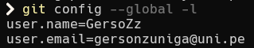


# git log

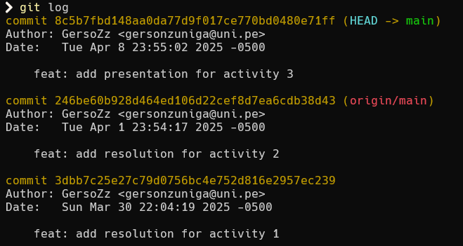


### git log --graph --pretty=format:'%x09 %h %ar ("%an") %s'

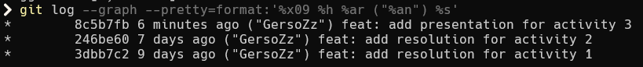

### git log --oneline

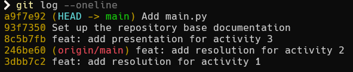


## Crear una rama desde una rama específica

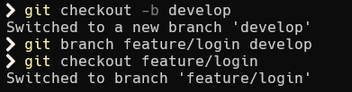


# Preguntas

### ¿Cómo te ha ayudado Git a mantener un historial claro y organizado de tus cambios?

Cada progreso que hago en mi código lo registro mediante un commit. Si más adelante me doy cuenta que cierta feature está fallando, puedo revisar exacatmente el commit donde hice ese cambio y corregirlo facilmente.

### ¿Qué beneficios ves en el uso de ramas para desarrollar nuevas características o corregir errores?

Es útil para separar el código que se va a usar en los dintintos ambientes: Producción, Pruebas, Desarrollo. De esta forma nos aseguramos que el código que se usa en producción sea lo mejor posible.

### Realiza una revisión final del historial de commits para asegurarte de que todos los cambios se han registrado correctamente.

Todo ok

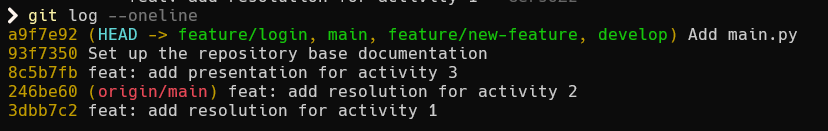

### Revisa el uso de ramas y merges para ver cómo Git maneja múltiples líneas de desarrollo.

En efecto, sí.

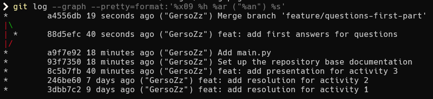

# Ejercicios

### Resolver conflictos 

Conflicto

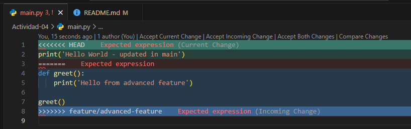

Resolucion del conflicto

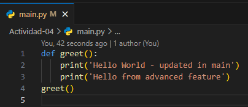

Merge y borrar rama

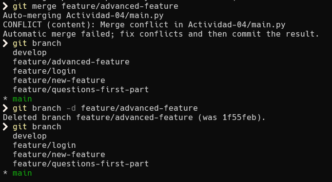


## Ejercicio 2: Exploración y manipulación del historial de commits

### Ver el historial detallado de commits:

```bash
git log -p
```

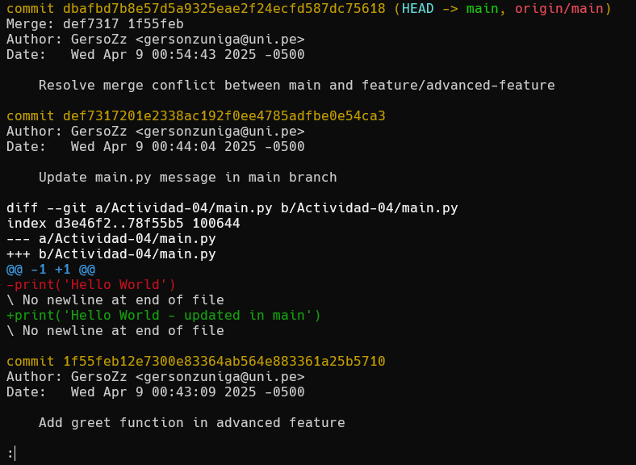


### Filtrar commits por autor

```bash
git log --author="GersoZz"
```

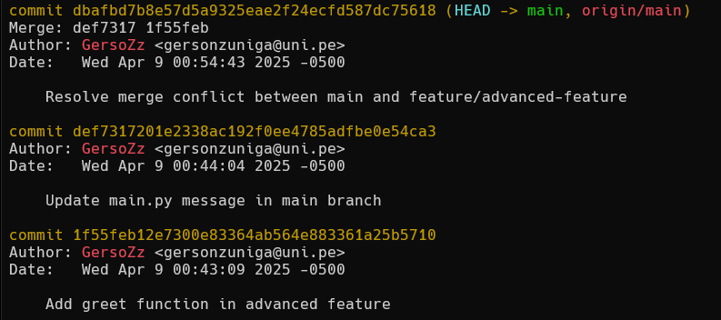
